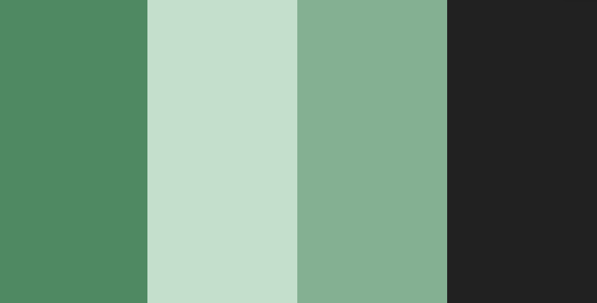
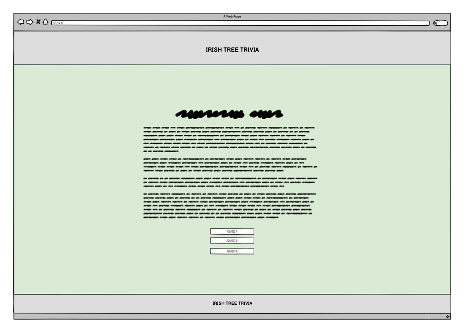
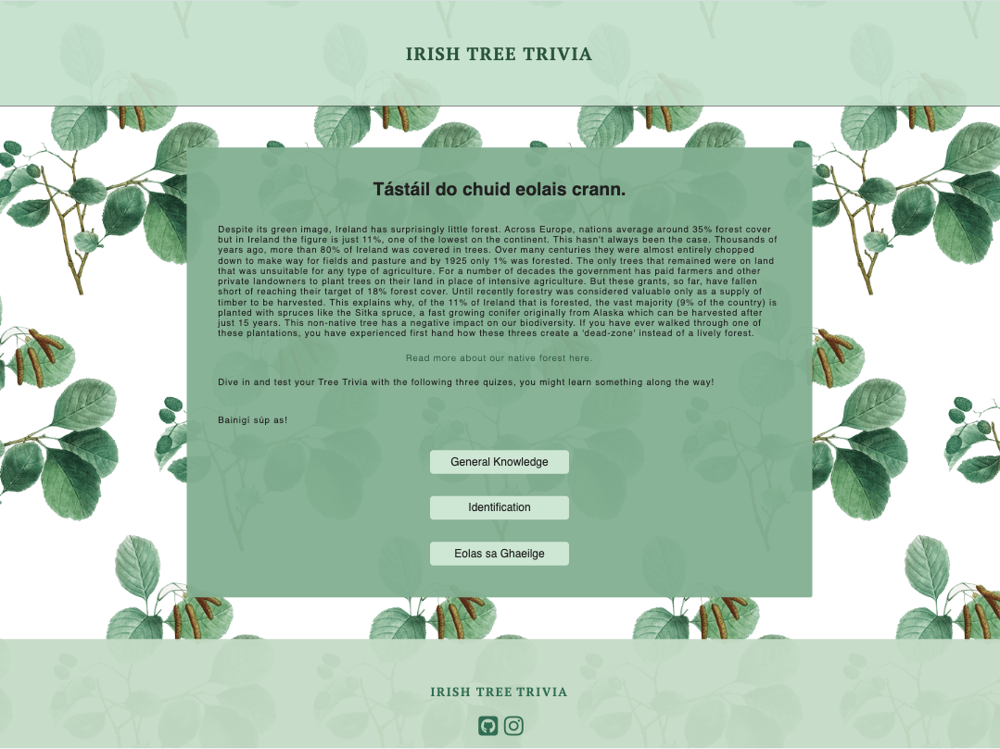
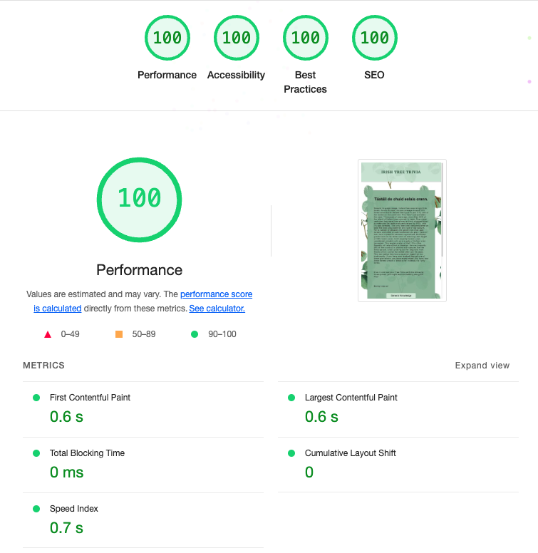
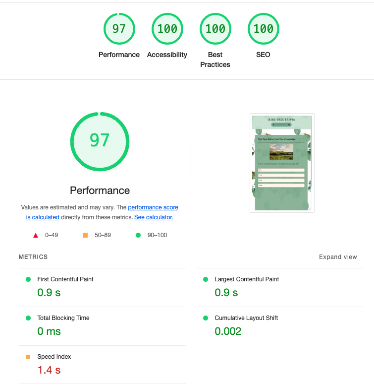
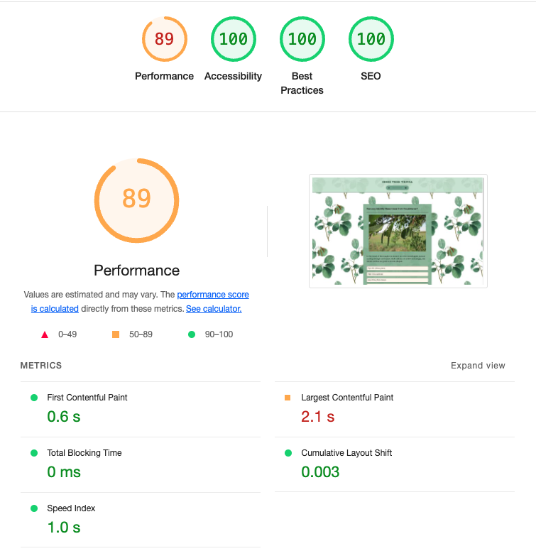
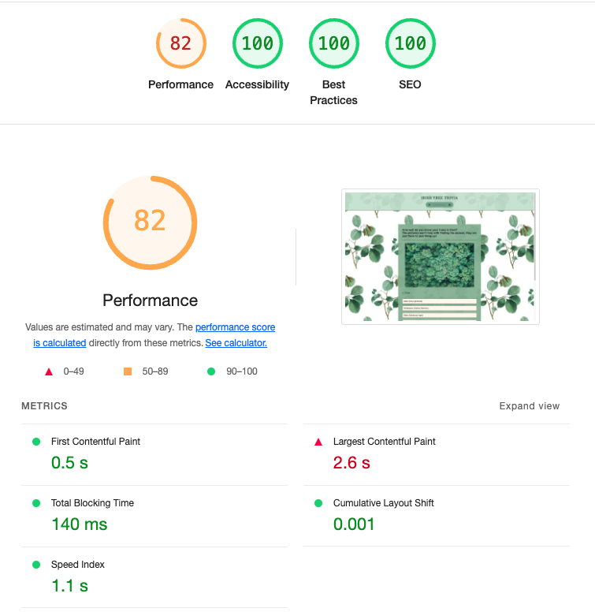
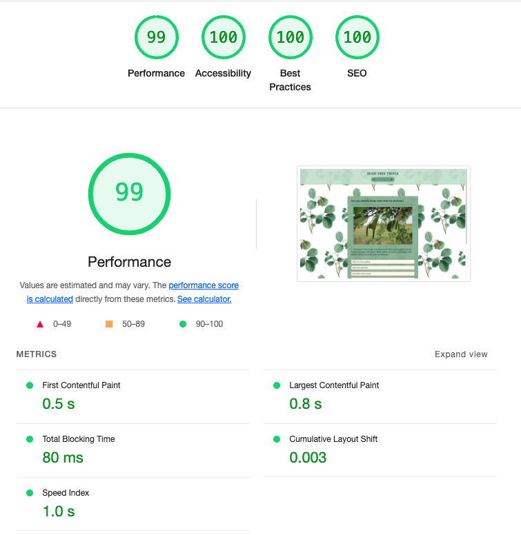

# IRISH TREE TRIVIA


[View Live Website here.](https://lemmenaid.github.io/Irish-tree-trivia/)

[GitHub Repo](https://github.com/LemmenAid/Irish-tree-trivia)

*** 

## Project Description  

_Irish Tree Trivia an interactive, front-end website developed for my second portfolio project with [Code Institute](https://codeinstitute.net/ie/)._

Irish Tree Trivia is a website that hopes to enthuse and inform people about our native Irish trees.
The site is targeted towards people who live in Ireland and are either interested in trees already or who are looking for a quiz to do online. The site will be useful for everyone who would like to know more about trees and wants to test their knowledge on the topic. The website provides three different quizes for people to play and potentially learn something along the way.

## Project Purpose

By creating a fun way for people to learn about the forests of Ireland this website hopes to help bring more awareness to Ireland's native forests and the state they are in. Despite its green image, Ireland has very little forest: just 11% (and only 2% if you purely look at native forest). However, thousands of years ago, more than 80% of Ireland was covered in trees. Over many centuries they were then almost entirely chopped down, mostly for agricultural purposes. Nowadays people believe that the green hills of Ireland are "natural", but as a matter of fact, they are man made and have created a poor enviroment for biodivesity. 

***

## Index – Table of Contents

* [User Experience (UX)](#user-experience) 
* [Design](#design)
* [Features](#features)
* [Technologies Used](#technologies-used)
* [Testing](#testing)
* [Solved Bugs](#solved-bugs)
* [Deployment](#deployment)
* [Credits](#credits)

***

## User Experience (UX)

### User Stories

1. As a first time user, I want to easily understand the main purpose of the site. 
2. As a new user, I want to easily navigate the site, so I can find what I need efficiently. 
3. As an interested user I want to be able to learn a bit about Ireland's forests.
4. As an interested user I want to be able to play the three quizes. 
5. As a returning user, I want to easily play the quiz again.

***

## Design

### Colour Scheme



* The colour scheme is inspired by the colour of a lush green forest. The green colour is used in different shades for the main background of the quiz, header and footer. The rest of the colours are kept in neutral whites and dark grays to maintain a sereen feeling.
* The shades of the colours are all chosen with good readability and accessibility in mind.
* The design was made to be aesthetically pleasing, to give users a positive and attractive feeling towards the subject - Irish trees. 

### Typography

* The typography used throughout the site is PT Serif for headings, and Helvetica for paragraphs. 
 PT Serif is imported from google fonts. PT Serif was chosen because for it’s readability in various sizes and to suit the botanical design of the website. As a fallback font Times and serif is used. The fallback font for Helvetica is sans-serif. The letter spacing has been increased slightly to improve readability in the paragraphs. For the headings letter spacing has also been applied, as well as a heavier font weight to make them stand out more. 

The following code has been imported into the top of the style.css

    @import url('https://fonts.googleapis.com/css2?family=PT+Serif:ital,wght@0,400;0,700;1,400;1,700&display=swap');

<br>

### Call to Action

* The call to action buttons on the landing page lead to the three different quizes. At the end of each quiz there is a call to action button to replay the game.
* All the buttons on the website are styled with a colour change so that it is clear for any visitor that these are buttons.
* The social media links will send the visitor to the social media pages. The links will open in a new tab.
* The header and footer logo have a colour change hover effect to make it clear that they are links.

### Imagery

Images used in the different quizes were selected for their aesthetic appeal and informative use.

Several free image sources were used:

QUIZ 1
* [quiz 1 - 1](https://unsplash.com/photos/green-grass-field-under-cloudy-sky-during-daytime-gJQLVTyQfgQ?utm_content=creditShareLink&utm_medium=referral&utm_source=unsplash)
* [quiz 1 - 2](https://unsplash.com/photos/green-leafed-trees-during-daytime-oWRVjFQIwAY)
* [quiz 1 - 3](https://unsplash.com/photos/trees-in-forest-7zg5bnhm2X0?utm_content=creditShareLink&utm_medium=referral&utm_source=unsplash)
* [quiz 1 - 4](https://unsplash.com/photos/shallow-focus-photography-of-eating-squirrel-tlQdhL5D0co?utm_content=creditShareLink&utm_medium=referral&utm_source=unsplash)
* [quiz 1 - 5](https://unsplash.com/photos/a-close-up-of-some-plants-sPrBqjGj7Qo?utm_content=creditShareLink&utm_medium=referral&utm_source=unsplash)
* [quiz 1 - 6](https://unsplash.com/photos/an-aerial-view-of-a-tree-in-a-grassy-field-gkkmtA7wUmU?utm_content=creditShareLink&utm_medium=referral&utm_source=unsplash)
* [quiz 1 - 7](https://unsplash.com/photos/green-trees-near-white-snow-covered-mountain-during-daytime-w-RvCKQtH6Y?utm_content=creditShareLink&utm_medium=referral&utm_source=unsplash)
* [quiz 1 - 8](https://unsplash.com/photos/a-close-up-of-a-leaf-with-a-blurry-background-eKo2Xum1Iuc?utm_content=creditShareLink&utm_medium=referral&utm_source=unsplash)
* [quiz 1 - 9](https://unsplash.com/photos/brown-tree-trunk-in-close-up-photography-QYvCXztbIAM?utm_content=creditShareLink&utm_medium=referral&utm_source=unsplash)
* [quiz 1 - 10](https://unsplash.com/photos/selective-photography-of-green-leaf-plant-Rfflri94rs8?utm_content=creditShareLink&utm_medium=referral&utm_source=unsplash)

QUIZ 2
* [quiz 2 - 1](https://www.pexels.com/photo/branch-of-alder-with-dry-cones-4148765/)
* quiz 2 - 2 photo taken by me.
* [quiz 2 - 3](https://unsplash.com/photos/green-tree-under-blue-sky-during-daytime-HZnv85PAjsw?utm_content=creditShareLink&utm_medium=referral&utm_source=unsplash)
* [quiz 2 - 4](https://unsplash.com/photos/a-close-up-of-two-white-flowers-on-a-tree-branch-nHQLOS0h1CI?utm_content=creditShareLink&utm_medium=referral&utm_source=unsplash)
* [quiz 2 - 5](https://www.pexels.com/photo/white-hawthorn-blossoms-16939815/)
* [quiz 2 - 6](https://unsplash.com/photos/purple-round-fruit-in-close-up-photography-qSmomJCEUiA?utm_content=creditShareLink&utm_medium=referral&utm_source=unsplash)
* [quiz 2 - 7](https://unsplash.com/photos/macro-shot-photography-of-red-fruits-O9PAfIVVvQc?utm_content=creditShareLink&utm_medium=referral&utm_source=unsplash)
* [quiz 2 - 8](https://unsplash.com/photos/brown-squirrel-on-green-pine-tree-vLwYNZ_kPjk?utm_content=creditShareLink&utm_medium=referral&utm_source=unsplash)
* [quiz 2 - 9](https://unsplash.com/photos/a-bunch-of-red-berries-are-growing-on-a-tree-vmxtlEFHl14?utm_content=creditShareLink&utm_medium=referral&utm_source=unsplash)
* [quiz 2 - 10](https://unsplash.com/photos/a-bunch-of-white-flowers-that-are-in-the-grass-odF3wlwh9nE?utm_content=creditShareLink&utm_medium=referral&utm_source=unsplash)

QUIZ 3
* [quiz 3 - 1](https://unsplash.com/photos/green-trees-on-forest-during-daytime-RJdt6wGw4wk?utm_content=creditShareLink&utm_medium=referral&utm_source=unsplash)
* [quiz 3 - 2](https://unsplash.com/photos/a-forest-at-night-hfVlwwbko_o?utm_content=creditShareLink&utm_medium=referral&utm_source=unsplash)
* [quiz 3 - 3](https://unsplash.com/photos/scenery-of-a-waterfall-5VgNytqbgfg?utm_content=creditShareLink&utm_medium=referral&utm_source=unsplash)
* [quiz 3 - 4](https://unsplash.com/photos/a-path-in-the-middle-of-a-forest-with-lots-of-trees-JWa5jZ1LkJY?utm_content=creditShareLink&utm_medium=referral&utm_source=unsplash)
* [quiz 3 - 5](https://unsplash.com/photos/aerial-photography-of-mountain-RVvr_g5-u3M?utm_content=creditShareLink&utm_medium=referral&utm_source=unsplash)
* [quiz 3 - 6](https://unsplash.com/photos/birds-eye-view-photography-of-trees-and-body-of-water-mawU2PoJWfU)
* [quiz 3 - 7](https://unsplash.com/photos/a-group-of-trees-in-the-middle-of-a-forest-jwtxxaA_iLA?utm_content=creditShareLink&utm_medium=referral&utm_source=unsplash)
* [quiz 3 - 8](https://unsplash.com/photos/selective-focus-photography-of-green-plant-r2WY7FHrlvg?utm_content=creditShareLink&utm_medium=referral&utm_source=unsplash)
* [quiz 3 - 9](https://unsplash.com/photos/concrete-castle-on-cliff-near-body-of-water-during-daytime-OsZJaYdAMw0?utm_content=creditShareLink&utm_medium=referral&utm_source=unsplash)
* [quiz 3 - 10](https://unsplash.com/photos/brown-road-in-forest-during-daytime-L505cPnmIds?utm_content=creditShareLink&utm_medium=referral&utm_source=unsplash)

For the background of the website a free image was used to make a pattern:

* [Image used for pattern](https://www.freepik.com/free-vector/alder-plant_4089192.htm#fromView=search&page=2&position=14&uuid=f377759a-0798-4c43-af85-19185ffc28d4/)

### Layout / Wireframes

* The basic design layout of the website has been made using wireframes with Balsamiq. 
* Responsive design has been used for creating this website. 

#### Home Page
<br>

#### Quiz Page
<br>

***

## Features

### General Features on each page

#### Header

* The header includes the Tree Trivia logo with a link to the homepage. This allows the user to always be able to navigate back to the main page without having to use the ‘back’ button. 


#### The Footer

  * Featured on all pages, the footer section includes the Tree Trivia logo with a link to the home page.
  * The footer section includes links to the relevant social media sites for Tree trivia. The links will open to a new tab to allow easy navigation for the user. 


### Features by page

#### Main Page

* The landing page starts with a paragraph that gives some information about Ireland's native forests.
* Underneath the information paragraph there are three buttons that lead to the three different quizes. 



#### Quiz Page

* The quiz page has the same design and lay-out for all three quizes. It has a container for the multiple choice question, the four answer options and an image. 
* After the user clicks on an option the quiz will show if the answer was correct or incorrect using background colours. After answering the button to the next question appears.


### Future Implementations

* A page with useful links to other websites that can give informatioon about Ireland's trees. For instance non-profit organisations that do re-foresting projects.
* A page that gives visitors information on how to succesfully plant and grow trees in their own garden.

*** 

## Technologies Used

* HTML5 - Mark-up language using semantic structure.
* CCS3 - Cascading stylesheet used to style the website.
* JavaScript - used to create an interactive website.
* Gitpod.io - For writing the code. Using the command line for committing and pushing to Git Hub
* GitHub - Used to host repository 

### Design
* PT Serif Font from [Google Fonts](https://fonts.google.com/) 
* Icons from [Font Awesome](https://fontawesome.com/)
* Favicon [Favicon](https://favicon.io)
* Wireframes [Balsamiq wireframe](https://balsamiq.com/)
* Images from several sources, underwhich [Pexels](https://www.pexels.com/)
* Colour palette generator [Coolors](https://coolors.co/)

### Testing
* Testing validity of HTML with [Validator](https://validator.w3.org/) 
* Testing validity of CSS with [CSS Validator](https://validator.w3.org/)
* Checking responsive nature with [UI](https://ui.dev/amiresponsive?/)
* Testing performance and accessibility with DEV Tools - Lighthouse

***

## Testing

The website has been tested by myself and several of my friends for accessibility, functionality, responsiveness, performance and visual appeal.

### Functionality

| Feature | Testing Performed | Expected Outcome | Pass/Fail |
| --- | --- | --- | --- |
| Irish Tree Trivia Logo and Title | Click Logo and Title | When clicked the user will be redirected to the home page. | PASS |
| Internal Links | Click on internal links | Internal links redirect to where they should. | PASS |
| External Links | Click on external links | External links go where they should and open in separate tab. | PASS |
| Social Media Icons | Click Icons | When clicked the user will be redirected to the appropriate social media pages in a separate tab. | PASS |
| Quiz function | Answer all questions in quiz and get score | User input returns total score | PASS |


### Browser Compatibility
* The site has been tested on serveral different devices, under which; iPhone SE / iPhone 12 / iPhone 14 / Samsung Galaxy S9 / MacBook Air / MacBook Pro / HP laptop.
* The website has been tested in the following browsers: Chrome / Safari / Firefox / Microsoft Edge.

### Responsivness
* The website has been tested on different screen sizes and it's responsive on all screens from mobile phones to desktops.
* Chrome DEV Tools have been used to check the responsivness.

### Validator Testing

#### HTML
* The [W3C](https://validator.w3.org/) Markup Validator was used to validate every page of the project to check that there were no syntax errors made in the HTML code.

* There was one error returned about an inline style attribute:


* I removed the inline style attribute and solved it with CSS. After that no errors were returned for any of the pages.


#### CSS
* The [Jigsaw](https://jigsaw.w3.org/css-validator/validator) CSS Validator Services was used to validate the CSS code to make sure that no syntax errors were made in this project.

* Two value errors were returned:<br>


* After fixing that by adding a pixel value to the width and height, no errors were returned.<br>


* There were still a few warnings displayed about using the same colour for a background and border, but I have done that intentional, so I am happy with the outcome.<br>


### Lighthouse

After validator testing I have used Chrome’s Lighthouse developer tool to check all pages for performance and accessibility. 

#### Main Page



#### quiz 1 Page



#### quiz 3 Page



#### quiz 3 Page



#### Score Page



***

## Solved Bugs

* During testing I realised there was a shift in the page after answering a question. This was because of the container box that would grow bigger due to the next-button appearing. I fixed this by making the container, image and question size fixed.
* 

***

## Deployment

I have taken the following from the Sample README from Code Institute for this deployment section.

### GitHub Pages

The project was deployed to GitHub Pages using the following steps...

1. Log in to GitHub and locate the [GitHub Repository](https://github.com/)
2. At the top of the Repository (not top of page), locate the "Settings" Button on the menu.
    - Alternatively Click [Here](https://raw.githubusercontent.com/) for a GIF demonstrating the process starting from Step 2.
3. Scroll down the Settings page until you locate the "GitHub Pages" Section.
4. Under "Source", click the dropdown called "None" and select "Master Branch".
5. The page will automatically refresh.
6. Scroll back down through the page to locate the now published site [link](https://github.com) in the "GitHub Pages" section.

### Forking

By forking the GitHub Repository we make a copy of the original repository on our GitHub account to view and/or make changes without affecting the original repository by using the following steps...

1. Log in to GitHub and locate the [GitHub Repository](https://github.com/)
2. At the top of the Repository (not top of page) just above the "Settings" Button on the menu, locate the "Fork" Button.
3. You should now have a copy of the original repository in your GitHub account.

### Making a Local Clone

1. Log in to GitHub and locate the [GitHub Repository](https://github.com/)
2. Under the repository name, click "Clone or download".
3. To clone the repository using HTTPS, under "Clone with HTTPS", copy the link.
4. Open Git Bash
5. Change the current working directory to the location where you want the cloned directory to be made.
6. Type `git clone`, and then paste the URL you copied in Step 3.

```
$ git clone https://github.com/YOUR-USERNAME/YOUR-REPOSITORY
```

7. Press Enter. Your local clone will be created.

```
$ git clone https://github.com/YOUR-USERNAME/YOUR-REPOSITORY
> Cloning into `CI-Clone`...
> remote: Counting objects: 10, done.
> remote: Compressing objects: 100% (8/8), done.
> remove: Total 10 (delta 1), reused 10 (delta 1)
> Unpacking objects: 100% (10/10), done.
```

***

## Credits

* I would like to thank Brian Macharia for his great mentor support and guidance - helping me through the process of building my first ever interactive website.
* My facilitator Amy from Code Institute for supporting us through our first project and giving us great tips and resources for learning tools, and her feedback during the weekly stand-ups.
* At last I would like to give thanks to my friends for taking the time to test the website and giving me great feedback.

### Content

Idea and content are developed by myself. 

For the intro text about Ireland's native forest I have used several sources:
* [Tree Council Ireland](https://www.treecouncil.ie/native-irish-trees)
* [Down To Earth](https://www.downtoearth.org.in/blog/forests/ireland-has-lost-almost-all-of-its-native-forests-here-s-how-to-bring-them-back-87926)


I have taken information from the following websites to create the multiple choice questions:
* [Woodland Trust](https://www.woodlandtrust.org.uk/)
* [The Conversation](https://theconversation.com/ireland-has-lost-almost-all-of-its-native-forests-heres-how-to-bring-them-back-195511)
* [Teagasc](https://www.teagasc.ie/crops/forestry/advice/general-topics/history-of-forestry-in-ireland/)
* [Irish Wild Flowers](https://www.irishwildflowers.ie/AZ-more.html)

### Media

All but one images are taken from free sources. You can find the links below:

QUIZ 1
* [quiz 1 - 1](https://unsplash.com/photos/green-grass-field-under-cloudy-sky-during-daytime-gJQLVTyQfgQ?utm_content=creditShareLink&utm_medium=referral&utm_source=unsplash)
* [quiz 1 - 2](https://unsplash.com/photos/green-leafed-trees-during-daytime-oWRVjFQIwAY)
* [quiz 1 - 3](https://unsplash.com/photos/trees-in-forest-7zg5bnhm2X0?utm_content=creditShareLink&utm_medium=referral&utm_source=unsplash)
* [quiz 1 - 4](https://unsplash.com/photos/shallow-focus-photography-of-eating-squirrel-tlQdhL5D0co?utm_content=creditShareLink&utm_medium=referral&utm_source=unsplash)
* [quiz 1 - 5](https://unsplash.com/photos/a-close-up-of-some-plants-sPrBqjGj7Qo?utm_content=creditShareLink&utm_medium=referral&utm_source=unsplash)
* [quiz 1 - 6](https://unsplash.com/photos/an-aerial-view-of-a-tree-in-a-grassy-field-gkkmtA7wUmU?utm_content=creditShareLink&utm_medium=referral&utm_source=unsplash)
* [quiz 1 - 7](https://unsplash.com/photos/green-trees-near-white-snow-covered-mountain-during-daytime-w-RvCKQtH6Y?utm_content=creditShareLink&utm_medium=referral&utm_source=unsplash)
* [quiz 1 - 8](https://unsplash.com/photos/a-close-up-of-a-leaf-with-a-blurry-background-eKo2Xum1Iuc?utm_content=creditShareLink&utm_medium=referral&utm_source=unsplash)
* [quiz 1 - 9](https://unsplash.com/photos/brown-tree-trunk-in-close-up-photography-QYvCXztbIAM?utm_content=creditShareLink&utm_medium=referral&utm_source=unsplash)
* [quiz 1 - 10](https://unsplash.com/photos/selective-photography-of-green-leaf-plant-Rfflri94rs8?utm_content=creditShareLink&utm_medium=referral&utm_source=unsplash)

QUIZ 2
* [quiz 2 - 1](https://www.pexels.com/photo/branch-of-alder-with-dry-cones-4148765/)
* quiz 2 - 2 photo taken by me.
* [quiz 2 - 3](https://unsplash.com/photos/green-tree-under-blue-sky-during-daytime-HZnv85PAjsw?utm_content=creditShareLink&utm_medium=referral&utm_source=unsplash)
* [quiz 2 - 4](https://unsplash.com/photos/a-close-up-of-two-white-flowers-on-a-tree-branch-nHQLOS0h1CI?utm_content=creditShareLink&utm_medium=referral&utm_source=unsplash)
* [quiz 2 - 5](https://www.pexels.com/photo/white-hawthorn-blossoms-16939815/)
* [quiz 2 - 6](https://unsplash.com/photos/purple-round-fruit-in-close-up-photography-qSmomJCEUiA?utm_content=creditShareLink&utm_medium=referral&utm_source=unsplash)
* [quiz 2 - 7](https://unsplash.com/photos/macro-shot-photography-of-red-fruits-O9PAfIVVvQc?utm_content=creditShareLink&utm_medium=referral&utm_source=unsplash)
* [quiz 2 - 8](https://unsplash.com/photos/brown-squirrel-on-green-pine-tree-vLwYNZ_kPjk?utm_content=creditShareLink&utm_medium=referral&utm_source=unsplash)
* [quiz 2 - 9](https://unsplash.com/photos/a-bunch-of-red-berries-are-growing-on-a-tree-vmxtlEFHl14?utm_content=creditShareLink&utm_medium=referral&utm_source=unsplash)
* [quiz 2 - 10](https://unsplash.com/photos/a-bunch-of-white-flowers-that-are-in-the-grass-odF3wlwh9nE?utm_content=creditShareLink&utm_medium=referral&utm_source=unsplash)

QUIZ 3
* [quiz 3 - 1](https://unsplash.com/photos/green-trees-on-forest-during-daytime-RJdt6wGw4wk?utm_content=creditShareLink&utm_medium=referral&utm_source=unsplash)
* [quiz 3 - 2](https://unsplash.com/photos/a-forest-at-night-hfVlwwbko_o?utm_content=creditShareLink&utm_medium=referral&utm_source=unsplash)
* [quiz 3 - 3](https://unsplash.com/photos/scenery-of-a-waterfall-5VgNytqbgfg?utm_content=creditShareLink&utm_medium=referral&utm_source=unsplash)
* [quiz 3 - 4](https://unsplash.com/photos/a-path-in-the-middle-of-a-forest-with-lots-of-trees-JWa5jZ1LkJY?utm_content=creditShareLink&utm_medium=referral&utm_source=unsplash)
* [quiz 3 - 5](https://unsplash.com/photos/aerial-photography-of-mountain-RVvr_g5-u3M?utm_content=creditShareLink&utm_medium=referral&utm_source=unsplash)
* [quiz 3 - 6](https://unsplash.com/photos/birds-eye-view-photography-of-trees-and-body-of-water-mawU2PoJWfU)
* [quiz 3 - 7](https://unsplash.com/photos/a-group-of-trees-in-the-middle-of-a-forest-jwtxxaA_iLA?utm_content=creditShareLink&utm_medium=referral&utm_source=unsplash)
* [quiz 3 - 8](https://unsplash.com/photos/selective-focus-photography-of-green-plant-r2WY7FHrlvg?utm_content=creditShareLink&utm_medium=referral&utm_source=unsplash)
* [quiz 3 - 9](https://unsplash.com/photos/concrete-castle-on-cliff-near-body-of-water-during-daytime-OsZJaYdAMw0?utm_content=creditShareLink&utm_medium=referral&utm_source=unsplash)
* [quiz 3 - 10](https://unsplash.com/photos/brown-road-in-forest-during-daytime-L505cPnmIds?utm_content=creditShareLink&utm_medium=referral&utm_source=unsplash)

For the background of the website a free image was used to make a pattern:

* [Image used for pattern](https://www.freepik.com/free-vector/alder-plant_4089192.htm#fromView=search&page=2&position=14&uuid=f377759a-0798-4c43-af85-19185ffc28d4/)


### Code

Because I wanted to make a quiz I could not use the walkthrough project "Love Maths" as a start of point. 
I looked for inspiration online and found a tutorial video (see link below). I adapted the JavaScript code from this video to fit my project. 
I have used some of the css code for inspration from my previous portfolio project "The Atlantic Dippers".
I have used various resources to help me with this:

* [How To Make Quiz App Using JavaScript | YouTube](https://youtu.be/PBcqGxrr9g8?feature=shared)
* [Build a Quiz App with JavaScript | YouTube](https://youtu.be/riDzcEQbX6k?si=2UDt5POf_5t2RH9x)
* Code Institute Slack Channel
* [Stack overflow](https://stackoverflow.com/)
* [Emmet](https://docs.emmet.io/cheat-sheet/)
* [W3Schools](https://www.w3schools.com/)
* [MDN Web Docs](https://developer.mozilla.org/en-US/)
* 

#### Templates I have used for inspiration and creating my readme-file:

I have used the readme file that I created for my first portfolio project to write this readme, for which I used the links below as a guide and inspiration.

* [Sample README Code Institute](https://github.com/Code-Institute-Solutions/SampleREADME/blob/master/README.md?plain=1) - Copied the Deployment section and used for general guideline.
* [Read Me Template Code Institute](https://github.com/Code-Institute-Solutions/readme-template/blob/master/README.md)
Used for general guideline.
* [Plant Factory - crypticCaroline](https://github.com/crypticCaroline/ms1-plantfactory/blob/master/README.md?plain=1) - Especially for the Technologies Used, Testing sections and design sections.
* [Visit Järbo - ClaudiaInSweden](https://github.com/ClaudiaInSweden/visit-jarbo/blob/main/README.md?plain=1) - General inspiration / guideline.
* [Mountain Magic Accomodation - Adrianskelton](https://github.com/Code-Institute-Submissions/Projecto1/blob/main/README.md) - Layout and general inspiration / guideline.
* [GitHub Docs](https://docs.github.com/en)